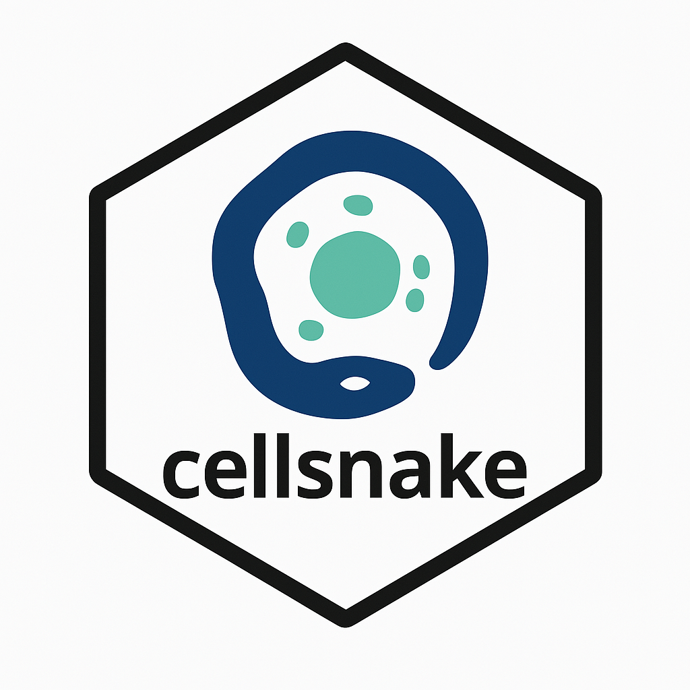

  
  
  

I am a senior bioinformatics research scientist at Department of Pathology, Institute of Clinical Medicine, University of Oslo, Norway and working in the [Jahnsen lab](https://jahnsenlab.org/).

- ⚡ I have been developing open-source bioinformatics tools downloaded by thousands including [MirMachine](https://github.com/sinanugur/MirMachine) and [cellsnake](https://github.com/sinanugur/cellsnake).

- 🔭 My research interests include biostatistics, bioinformatics, molecular epidemiology, spatial transcriptomics, single-cell and bulk RNA sequencing, early detection of cancer using ML and AI, RNA biology of cancer and RNA-RNA interactions.
  
- 🔭 I also have bioinformatics pipelines written in Snakemake (also in Python and R) like a small RNA sequencing pipeline, [sncRNA-workflow](https://github.com/sinanugur/sncRNA-workflow), or a WGS pipeline for HPV variant detection ([TaME-seq](https://github.com/sinanugur/TaME-seq))
  
- 🌱 I completed my doctoral studies in the fields of Biotechnology and Bioinformatics at the University of Canterbury in New Zealand. My research concentrated on the non-coding RNAs in prokaryotic organisms. The primary emphasis of my dissertation was on the interactions between non-coding RNAs and messenger RNAs within the genomes of bacteria and archaea.

The tools that I developed and published:

| Tool | Download  | Purpose |  
|----------|-----------|-----|  
|MirMachine|| microRNA homology search tool using machine learning|  
|Cellsnake ||single-cell analysis tool for everyone |  

The repository includes [a set of Jupyter notebooks](https://github.com/academicpages/academicpages.github.io/tree/master/markdown_generator
) that converts a CSV containing structured data about talks or presentations into individual markdown files that will be properly formatted for the Academic Pages template. The sample CSVs in that directory are the ones I used to create my own personal website at stuartgeiger.com. My usual workflow is that I keep a spreadsheet of my publications and talks, then run the code in these notebooks to generate the markdown files, then commit and push them to the GitHub repository.

**Research Interests**
* Modelling and early prediction models in the context of personalized medicine
* Molecular oncology and cancer
* RNA biology, especially non-coding RNAs such as microRNAs, tRNA-derived molecules
* RNA-RNA interactions
* Biostatistics and molecular epidemiology
* NGS (DNA and RNA sequencing), transcriptomics from bulk RNA sequencing to spatial transcriptomics
* Reproducible bioinformatics pipelines, mostly using Snakemake, shell scripts, Python and R programming

**Skills**
* R, I am quite capable in tidyverse syntax (ggplot, caret, mlr3, Rmarkdown, shiny apps, functional programming, parallelization)
* Machine learning and data analysis in R
* Python (especially in bioinformatics context)
* Snakemake (I develop pipelines and also teach Snakemake)
* Biostatistics (basic modeling, survival models, and some newer machine learning algorithms)
* Linux (shell scripting and high-performance computing systems)
* Data Science and Machine learning (for predictive models, especially in R and Python, h2o, caret, Keras)

  <h3>Some recent open source contributions I've made:</h3>
  <ul>
    <li>
      
    </li>
  </ul> 

